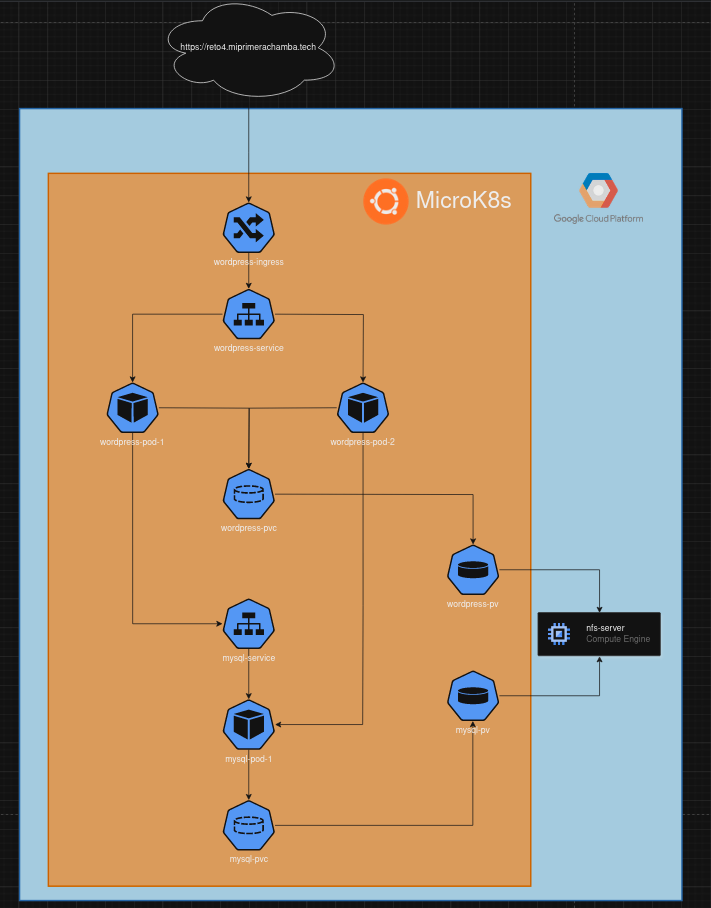
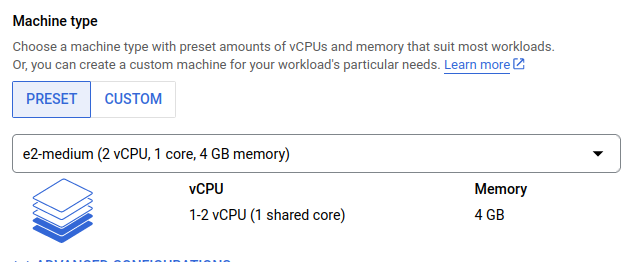
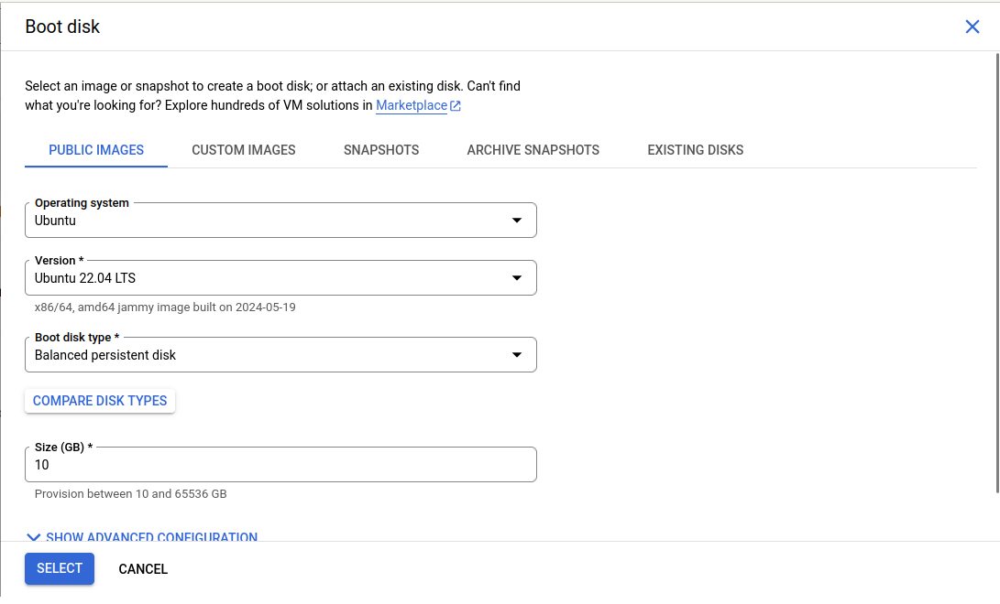
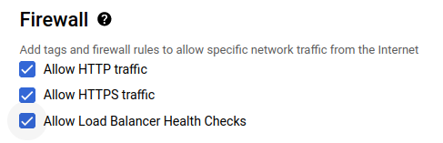
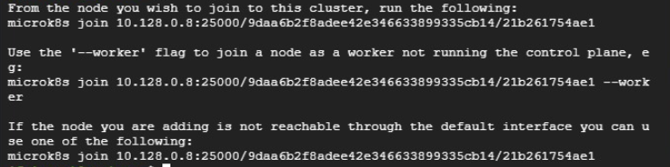
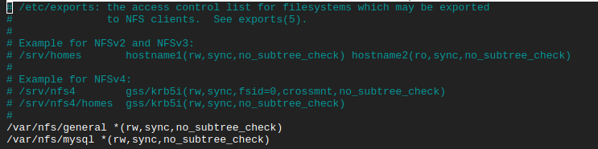

# Info de la materia: ST0263 Tópicos especiales de telemática

# Estudiante(s): Gian Paul Sánchez Aristizábal, gpsancheza@eafit.edu.co

# Profesor: Alvaro Ospina, aeospinas@eafit.edu.co

# Proyecto 2

---

# 1. Breve descripción de la actividad

## 1.1. Que aspectos cumplió o desarrolló de la actividad propuesta por el profesor (requerimientos funcionales y no funcionales)
Se desplegó la aplicación CMS/LMS (WordPress) en un clúster configurado con MicroK8s. El clúster se conforma por 3 nodos (1 master y 2 worker, donde todos tres pueden adquirir carga de trabajo), asegurando unna alta disponibilidad.

Se creó un dominio propio (miprimerachamba.tech | reto4.miprimerachamba.tech).

Se obtuvo un certificado SSL para estos dominios.

Se crearon replicas de wordpress usando un deployment con ciertas reglas especificadas en manifiestos, además de sus servicios, PersistenceVolume y PersistenceVolumeClaim.

Se crearon replicas de mysql (en este caso una unica replica) usando un deployment con ciertas reglas especificadas en manifiestos, además de sus servicios, PersistenceVolume y PersistenceVolumeClaim.

Se implementó NFS para compartir los archivos de wordpress y de base de datos, en una instancia de externa al cluster.

## 1.2. Que aspectos NO cumplió o desarrolló de la actividad propuesta por el profesor (requerimientos funcionales y no funcionales)

Se cumplió con todos los requisitos que tenía la actividad propuesta.

# 2. Información general. Diagrama de arquitectura.

El diagrama de arquitectura se muestra a continuación: 



Este diagrama es explicado un poco más a fondo en el video de las sutentación del proyecto.

En caso de no poder visualizar bien la imagen se puede acceder a el através de este link: 

# 3. Descripción del ambiente de desarrollo y técnico

Para este proyecto se utilizó el proveedor de servicios (IaaS) llamado Google Cloud Platform (GCP), sin embargo, como veremos más adelante no se hizo uso de ningún servicio administrado por la plataforma (externo a las instancias virtuales). A continuación se hará una guía paso a paso de como se construyó el sistema:

## 3.1. Creación de instancias en GCP (nodos)

Primero se debían crear las instancias virtuales que participarán en el sistema, por ende crearemos 4 isntancias (1 nodo master, 2 nodos worker y 1 instancia que funciona como servidor nfs). Todas estas instancias las creamos todas siguiendo la misma configuración, la cual tiene como tipo de instancia e2.medium





Disco de arranque con sistema operativo Ubuntu 22.04 LTS, con un tamaño de 10GB en mi caso



Y habilitando todas las reglas de firewall



Luego, para que todas las máquinas participen del cluster microK8s (es decir, todas menos el nfs-server) debemos instalar microk8s. Esto lo hacemos haciendo

```shell
sudo snap install microk8s --classic
```

Después debemos habilitar los servicios necesarios, en mi caso solo tuve que habilitar ingress y cert-manager (la cual será usada luego para generar los certificados SSL y que nos permita tener conexión a través de https) ya que los demás venían habilitados por defecto. Entonces hacemos:

```shell
microk8s enable ingress cert-manager
```

## 3.2. Creación del cluster

Al instalar microk8s ya tenemos como tal un cluster de microk8s corriendo, sin embargo debemos enlazar las instancias para que todas hagan parte de un único cluster. Para esto desde la instancia que definimos como master tenemos que ejecutar el siguiente comando cada que queramos agregar un nodo.

```shell
microk8s add-node
```

Esto mostrará unas lineas con unos tokens, como las siguientes:



Así, en la instancia worker debemos pegar la primera línnea que dice join y esperar a que este se conecte al cluster. Con esto bastaría para conectarlo.

## 3.3. Configuración del nfs-server

Una vez creada la instancia del nfs-server ejecutamos los siguientes comandos para instalar el paquete necesario para convertir esta máquina virtual en un servidor de archivos compartidos:

```shell
sudo apt-get update
sudo apt-get install nfs-kernel-server
```

Luego creamos los directorios que compratiremos a los clientes de este nfs y les daremos los permisos necesarios:

```shell
sudo mkdir -p /var/nfs/general
sudo chown nobody:nogroup /var/nfs/general

sudo mkdir -p /var/nfs/mysql
sudo chown nobody:nogroup /var/nfs/mysql
```

Luego editaremos el archivo `/etc/exports` para permitir las conexiones de los clientes que especifiquemos, en este caso le estaremos dando permisos a todos (OJO, en caso de tener datos sensibles es muy importante no hacer esto. Debido a que esto es una simulación se ignora). El archivo entonces se debe ver algo así:





Por último se reinicia el servicio para que este tome los cambios realizados y se verifica que haya quedado funcionando:

```shell
sudo systemctl restart nfs-kernel-server
sudo systemctl status nfs-kernel-server
```

## 3.4. Configuración de clientes de nfs

Debido a que todos los demás nodos del cluster van a usar archivos del servidor nfs debemos instalar un paquete que permita montar los volumentes que esté compartiendo este servidor, es decir, tanto en el nodo master, como en los 2 nodos worker debemos hacer lo siguiente:

```shell
sudo apt install nfs-common
```

Con esto estamos instalando la herramienta que nos permitirá conectarnos al nfs-server.

## 3.5. Configuración de los manifiestos

Después de todo lo anterior lo unico que querdaría hacer es posicionarnos en el nodo master y eplicar todos los manifiestos que encontramos en el repositorio en el siguiente orden:

1. wp-pv-pvc.yaml
2. mysql-pv-pvc.yaml
3. mysql-deployment.yaml
4. wp-deployment.yaml
5. cluster-issuer.yaml
6. wp-ingress.yaml

Estos manifiestos ya tiene adentro todas las instrucciones que kubectl va a usar para crear automáticamente los disintos pods, servicios, pv, pvc, etc.

En caso de obtener un error de permisos a la hora de aplicar el manifiesto del deployment de la abse de datos (es decir, mysql-deployment.yaml). Lo que se debe hacer es dirigirse a la instancia del servidor nfs y ejecutar lo siguiente:

```shell
sudo chown -R 999:999 /var/nfs/mysql
sudo chmod -R 777 /var/nfs/mysql
```

Esto dará unos permisos necesarios en la carpeta compartida de la base de datos.

# 5. Otra información que considere relevante para esta actividad.

## Video

El siguiente video el cual se encuentra en youtube contiene la sustentación del proyecto en donde se explica el proyecto y se ejecutan las pruebas para mostrar como está funcionando el sistema: [Video sustencación](https://youtu.be/6J4xXfW-x-8?si=TUQ6q5eFcHEM-Hp0)

# Referencias
- [Instalación](https://microk8s.io/)
- [Creación de cluster](https://microk8s.io/docs/clustering)
- [Configuración NFS](https://www.digitalocean.com/community/tutorials/how-to-set-up-an-nfs-mount-on-ubuntu-20-04-es)
- [Configuraciones para el ingress (Certificados SSL)](https://microk8s.io/docs/addon-cert-manager#automatically-generating-lets-encrypt-certificates-for-ingress-1)
- [Curso de Kubernetes (básico)](https://www.youtube.com/watch?v=d6WC5n9G_sM)
